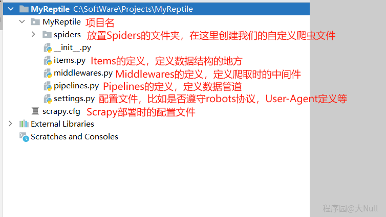

step1:
在目标文件下下，在cmd的指令模式下运行:scrapy startproject name_project

step2:
框架自动在目录下生成项目最小文件系统。

> --Project_name
   | ---spiders #自动生成文件夹,scrapy提供的spider类,定义spider处理爬取的结果
       | --__init__.py #
   | --__init__.py #
   | --items.py #
   | --middlewares.py #
   | --pipelines.py #
   | --settings.py #
   --scarpy_frist.py

   step3
   cd scrapy_frist #进入自己的ProjectNmae file
   scrapy genspider example example.com #生成spider方法类

    //理解项目初始文件架构
    
    https://img-blog.csdnimg.cn/direct/bd9722812c7d4b12b3d3b9c2007c4457.png#pic_center

    step4:
    后续每增加一个爬虫，就在这个文件夹下面执行一次(https://www.runoob.com/)
    scrapy genspider myspider(spider_name) https://www.runoob.com/(spider_url)

    step5
    运行方法①直接在工程路径下面运行指令： scrapy crawl myspider(这个一定是爬虫名字,不是项目名字)

    运行方法②在cfg文件径路下面创建一个run.py，使用代码模拟cmd模式。
    from scrapy import cmdline
    cmdline.execute(['scrapy','crawl','myspider'])

    二:启动服务器和客户端
    在scrapy的基础上，再套娃一层scrapyd，主要是用来实现cs服务和基本的服务器web服务的。
    ①安装cs服务
    pip install scrapyd
    pip install scrapyd-client

    ②启动服务器
    scrapyd （在scrapy路径下）

    ③拷贝python环境下的scripts文件夹中scrapyd-deploy.exe到scrapy的工程目录下，为了直接使用scrapyd指令
    或者：如果是windows系统，应该不会成功，需要再Python安装目录是Scripts目录下添加一个bat 
        scrapyd-deploy.bat文件，文件内容大致如下：
        "D:\Program Files\Python37\python.exe" "D:\Program Files\Python37\Scripts\scrapyd-deploy" %*

作者：不思九八
链接：https://www.jianshu.com/p/b7c02ceed164
来源：简书
著作权归作者所有。商业转载请联系作者获得授权，非商业转载请注明出处。

    ④部署爬虫到scrapd服务器上
    打开scrapy的配置文件：scrapy.cfg
    [deploy:项目名字]
    url = http://localhost:6800/
    project = 项目名字
    username=xXX
    访问服务器需要的用户名和密码(可以不写)
    password=xxx

    

    ⑤保持服务器的scrapyd的启动状态，新建有一个终端cmd

    ⑥：打包爬虫
    scrapyd-deploy scrapy_frist(scrapy项目) -p db(scrapyd项目展示的名字)
    返回：
    {"node_name": "hufan530", "status": "ok", "project": "db", "version": "1716701481", "spiders": 1}

    ⑦查看已经启动爬虫：
    scrapyd-deploy -l    查看部署名称和url

    ⑧在客户端这儿启动爬虫
    curl http://localhost:6800/schedule.json -d project=db(项目名称) -d spider=myspider(爬虫名称)

    curl http://localhost:6800/schedule.json -d project=db -d spider=myspider

    ⑨关闭爬虫
    关闭爬虫：curl http://localhost:6800/cancel.json -d project=db -d job=jobid

    注意：所有的curl的指令都要用电脑系统的cmd启动，别用shell或者powershell

    三，再套一层web管理器,之前的scrapyd的web太简陋而且功能太少了
    ①安装scrapydweb
    开发主机或任一台主机安装 ScrapydWeb： pip install scrapydweb

    ②修改配置文件
    运行命令 scrapydweb -h
    生成文件：scrapydweb_settings_v10

    剩下的你再慢慢探索scrapydweb的功能吧，比如有：
    1，日志分析/爬虫管理
    2，给出scrapy项目路径，网页上部署。
    3，邮件通知

    注意：scrapydweb 在哪个路径下启动的,他使用的配置就用的哪个路径下的配置：scrapydweb_settings_v10

